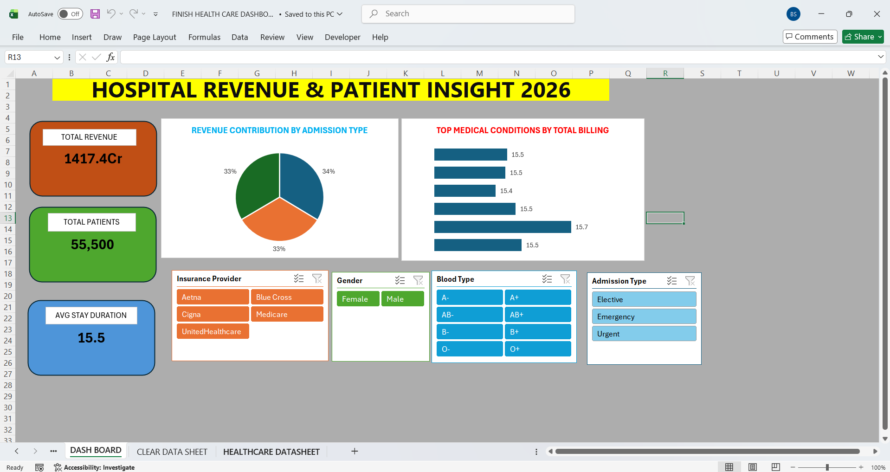

# 🏥 Hospital Revenue & Patient Insights Dashboard (Excel)

An enterprise-level healthcare operations dashboard built in Excel to audit hospital billings, admission types, and health care delivery metrics.

## 🚀 Key Performance Indicators (KPIs)
* **Total Hospital Revenue:** 1417.4 Cr
* **Total Patients Managed:** 55,500
* **Average Stay Duration:** 15.5 Days

## 🔍 Core Visual Insights
* **Operational Distribution:** Analyzed admission type revenues across Elective, Emergency, and Urgent intakes.
* **Medical Segmentation:** Ranked top medical conditions based on billing volume and length of stay.
* **Patient Demographics:** Cross-filtered operations using dynamic slicers for Insurance Providers (Aetna, Medicare, Cigna), Blood Types, and Gender.

## 🛠️ Tech Stack & Methodology
* **Tool:** Microsoft Excel (Data Analytics)
* **Features Used:** Enterprise Data Management, Multi-Slicer Alignment, Pivot Layouts, and Healthcare BI Framework.

---

## 📷 Dashboard Screenshot

## 🎥 Interactive Workflow (Silent Walkthrough)

